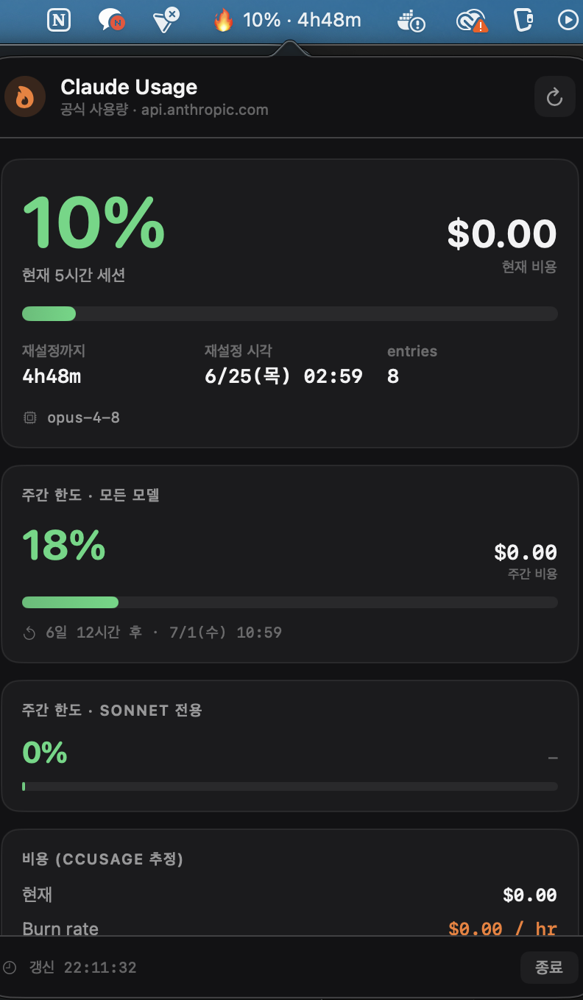

# Claude Usage Monitor

macOS 메뉴바에서 **Claude 사용량**을 실시간으로 보여주는 가벼운 네이티브 앱입니다.
공식 엔드포인트(`api.anthropic.com`)의 5시간·주간 한도 사용률을 메뉴바에 표시하고,
드롭다운에서 비용·토큰·burn rate 등 상세를 함께 보여줍니다.

> 메뉴바 표시 예: `🔥 58% · 2h41m` (현재 5시간 세션 사용률 · 재설정까지 남은 시간)




## 특징

- **공식 사용량 기반** — Claude Code가 로그인 시 Keychain에 저장한 OAuth 토큰을 읽어
  `https://api.anthropic.com/api/oauth/usage` 를 직접 호출합니다. 사용률(%)과 재설정 시각은 공식 값입니다.
- **상세는 ccusage 참고** — 비용/토큰/burn rate는 [`ccusage`](https://github.com/ryoppippi/ccusage) 로컬 데이터를 병합해 표시합니다.
- **순수 Swift + SwiftUI** — Electron/Node 의존성 없음. 단일 Mach-O 바이너리(약 600KB).
- **백그라운드 상주** — Dock 아이콘 없이 메뉴바에만 존재(`LSUIElement`). 60초마다 자동 갱신.

## 요구 사항

| 항목 | 설명 |
|------|------|
| macOS | 13.0 (Ventura) 이상 |
| 칩셋 | Apple Silicon (arm64) |
| [Claude Code](https://claude.com/claude-code) | **설치 + 로그인 필수.** Keychain 항목 `Claude Code-credentials` 에서 토큰을 읽습니다. 로그인이 안 돼 있으면 메뉴바에 `🔒 로그인` 으로 표시됩니다. |
| [ccusage](https://github.com/ryoppippi/ccusage) | 선택. 비용/토큰 상세 표시에 필요. Homebrew 경로 `/opt/homebrew/bin/ccusage` 를 사용합니다. 없으면 사용률(%)만 표시됩니다. |

> **Intel Mac**: 현재 ccusage 경로(`/opt/homebrew/bin`)와 빌드 타깃이 Apple Silicon 기준입니다.
> Intel에서 쓰려면 `src/Providers.swift` 의 경로와 빌드 아키텍처 조정이 필요합니다.

## 빌드 & 설치

Xcode 또는 Command Line Tools(`xcode-select --install`)의 `swiftc` 만 있으면 됩니다.

```bash
git clone <이 저장소 URL>
cd claude-usage-monitor
./build.sh            # 빌드 후 ~/Applications 에 설치
./build.sh --dmg      # 추가로 배포용 dist/ClaudeUsageMonitor.dmg 생성
```

빌드가 끝나면 `~/Applications/ClaudeUsageMonitor.app` 을 실행하세요. 메뉴바에 아이콘이 나타납니다.

### 자동 실행 등록(선택)

`시스템 설정 → 일반 → 로그인 항목` 에 `ClaudeUsageMonitor.app` 을 추가하면 부팅 시 자동 실행됩니다.

## 다른 사람에게 배포할 때 (Gatekeeper 안내)

이 앱은 **ad-hoc 서명**만 돼 있습니다(유료 Apple Developer 인증서로 notarize하지 않음).
그래서 다른 맥에서 `.dmg`/`.app` 을 처음 열면 *"확인되지 않은 개발자"* 경고로 차단됩니다.
받는 사람은 아래 중 하나로 우회할 수 있습니다.

- **Finder에서 우클릭 → 열기 → 열기** (최초 1회)
- 또는 터미널에서 격리 속성 제거:
  ```bash
  xattr -dr com.apple.quarantine "/Applications/Claude Usage Monitor.app"
  ```

> 최초 실행 시 Keychain 접근 허용 프롬프트가 한 번 뜰 수 있습니다(토큰을 읽기 위함). **항상 허용**을 누르면 됩니다.
> 경고 없이 배포하려면 Apple Developer Program($99/년)에 가입해 Developer ID 서명 + notarization이 필요합니다.

## 코드 구조

```
src/
├── main.swift       앱 진입점 · NSStatusItem · 팝오버 토글 · 폴링 타이머
├── Models.swift     공식/ccusage 응답 모델 · 날짜·숫자 포맷 헬퍼
├── Providers.swift  Keychain 토큰 조달 · 공식 usage API · ccusage 호출
├── Store.swift      두 Provider 결과 병합 · 메뉴바 타이틀 계산
├── Views.swift      SwiftUI 드롭다운 UI
└── Theme.swift      다크 테마 색상·타이포
Info.plist           번들 메타데이터 (LSUIElement 등)
build.sh             컴파일 → .app 번들 → ad-hoc 서명 → (옵션) .dmg
```

설계 문서: [`docs/superpowers/specs/2026-06-08-claude-usage-monitor-design.md`](docs/superpowers/specs/2026-06-08-claude-usage-monitor-design.md)

## 개인정보

- 토큰은 **로컬 Keychain에서만** 읽혀 Anthropic 공식 API 호출에 사용됩니다. 외부로 전송하거나 저장하지 않습니다.
- ccusage 데이터도 로컬에서만 읽습니다(`--offline`).
- **익명 진단(기본 on, 끌 수 있음)**: 앱은 공식 사용량 조회의 **결과 분류·HTTP 상태 및 오류 코드·프록시 사용 여부·앱/OS 버전·무작위 생성된 익명 설치 ID(설치별 임의 UUID)**
  익명으로 전송해 배포판 이슈를 파악합니다. **토큰·사용량 수치·계정 식별정보는 전송하지 않습니다.**
  `설정 → 진단`에서 언제든 끌 수 있습니다.
- **로컬 진단 로그(기본 off)**: 켜면 `~/Library/Logs/ClaudeUsageMonitor/` 에 조회 결과를 남깁니다(로컬 저장, 최대 512KB). 외부 전송 없음.

## 라이선스

[MIT](LICENSE)
